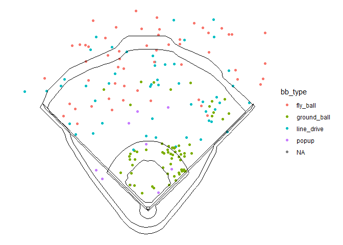
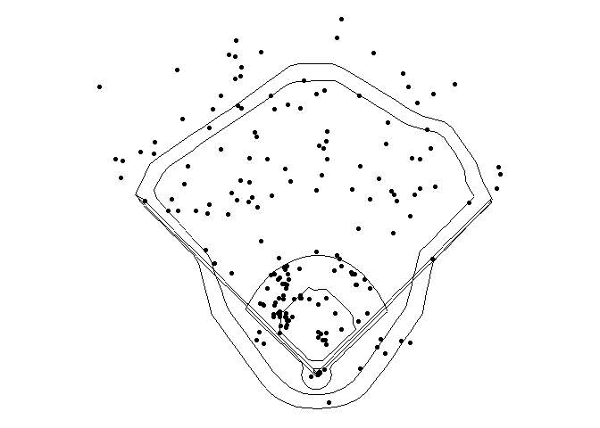
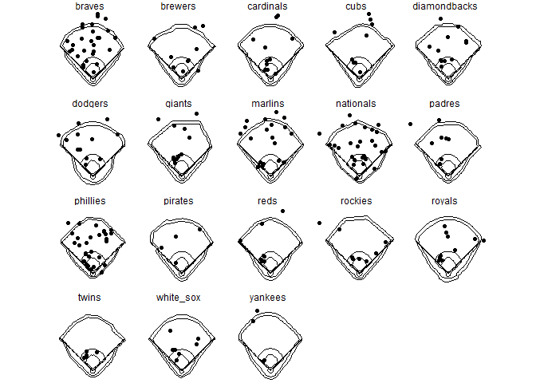

Visualization with GeomMLBStadiums Tutorial
================
Luke Beasley and Chris Russo

<<<<<<< HEAD
``` r
#devtools::install_github("bdilday/GeomMLBStadiums")
library(GeomMLBStadiums)
library(ggplot2)
library(dplyr)
```

    ## 
    ## Attaching package: 'dplyr'

    ## The following objects are masked from 'package:stats':
    ## 
    ##     filter, lag

    ## The following objects are masked from 'package:base':
    ## 
    ##     intersect, setdiff, setequal, union

``` r
load("pbp2019.rda")

=======
Introduction
============

The GeomMLBStadiums package was created by Ben Dilday and is available via <https://github.com/bdilday/GeomMLBStadiums>. We present ways to work with this package and Statcast data gathered from <https://baseballsavant.mlb.com/statcast_search>.

Install and Load
================

``` r
if(!require(devtools)){
  install.packages("devtools")
}
devtools::install_github("bdilday/GeomMLBStadiums")
```

``` r
library(GeomMLBStadiums)
library(ggplot2)
library(dplyr)
```

Load Statcast Data from 2019 Regular Season
===========================================

``` r
load("pbp2019.rda")
```

Prepare Data
============

``` r
>>>>>>> 8cee1b719adc37c04295cfc9da8365e8b5243443
# convert all null to NA
pbp2019[pbp2019 == "null"] <- NA

# order
pbp2019 <- pbp2019 %>%
  mutate(game_date = as.Date(game_date, "%m/%d/%Y")) %>%
  arrange(game_date, home_team, at_bat_number, pitch_number)

# add indicator for stadium
team_ids <- data.frame(team = unique(MLBStadiumsPathData$team)[-31],
                       abbr = c("LAA","HOU","OAK","TOR","ATL",
                                "MIL","STL","CHC","ARI","LAD",
                                "SF","CLE","SEA","MIA","NYM",
                                "WSH","BAL","SD","PHI","PIT",
                                "TEX","TB","BOS","CIN","COL",
                                "KC","DET","MIN","CWS","NYY"),
                       stringsAsFactors = F)
<<<<<<< HEAD

=======
>>>>>>> 8cee1b719adc37c04295cfc9da8365e8b5243443
pbp2019 <- pbp2019 %>%
  left_join(team_ids, by = c("home_team" = "abbr"))

# convert variable types
pbp2019 <- pbp2019 %>%
  mutate(hc_x = as.numeric(hc_x),
         hc_y = as.numeric(hc_y),
         launch_speed = as.numeric(launch_speed))
```

<<<<<<< HEAD
# starting Luke’s part of the tutorial, so Chris you can add your part above this line - i just threw in what you sent me so I could run my part. You can write the tutorial part and add anything else needed

Once the foundation of plotting the hit locations on the stadium has
been laid, we can move on to a variety of interesting uses. A few
examples we will walk through include labelling by batted ball type
(bb\_type), comparing how different pitch types are scattered, analyzing
how a certain player performs across different stadiums, and determining
the effect of a home team’s stadium. Finally, we will pose some
questions that you can work on for yourself.

All analysis could be done with as many player data points as wanted,
but the graph would be cluttered, so we will stick to one player’s home
data (we split into home because we are going to look at his home
stadium. We can look at multiple stadiums but it will add complexity to
the graph). We will use 2018 NL MVP Christian Yelich. First, we find his
playerID from his MLB.com page (ID= 592885).

``` r
# select Pete Alonso batted balls home/away
yelich_home <- pbp2019 %>%
  filter(batter == 592885,
         home_team == "MIL",
         launch_speed > 0)
```

We will use yelich\_home just as before, but change the labelling to
bb\_type. From this chart, we can see any trends that emerge. For
example, it appears Yelich hits line drives to all parts of the field,
but tends to hit more ground balls to the right side of the field and
more fly balls to the left side of the field.

``` r
yelich_home %>% mlbam_xy_transformation() %>%  
  ggplot(aes(x=hc_x_, y=hc_y_, color = bb_type )) + 
  geom_spraychart(stadium_ids = "brewers",
=======
Plot Spray Chart of a Batter
============================

Select Pete Alonso Batted Balls
-------------------------------

``` r
# separate home and away

alonso_home <- pbp2019 %>%
  filter(batter == 624413,
         home_team == "NYM",
         launch_speed > 0)

alonso_away <- pbp2019 %>%
  filter(batter == 624413,
         home_team != "NYM",
         launch_speed > 0)
```

Plot on Single Stadium
----------------------

``` r
alonso_home %>% mlbam_xy_transformation() %>%  
  ggplot(aes(x=hc_x_, y=hc_y_)) + 
  geom_spraychart(stadium_ids = "mets",
>>>>>>> 8cee1b719adc37c04295cfc9da8365e8b5243443
                  stadium_transform_coords = TRUE, 
                  stadium_segments = "all") + 
  theme_void() + 
  coord_fixed()
```

<<<<<<< HEAD
    ## Warning: Removed 139 rows containing missing values (geom_point).

<!-- -->
=======


Plot on Multiple Stadiums
-------------------------

``` r
alonso_away %>% mlbam_xy_transformation() %>%  
  ggplot(aes(x=hc_x_, y=hc_y_)) + 
  geom_spraychart(stadium_ids = unique(alonso_away$team),
                  stadium_transform_coords = TRUE, 
                  stadium_segments = "all") + 
  theme_void() + 
  coord_fixed() +
  facet_wrap(~team)
```


>>>>>>> 8cee1b719adc37c04295cfc9da8365e8b5243443
